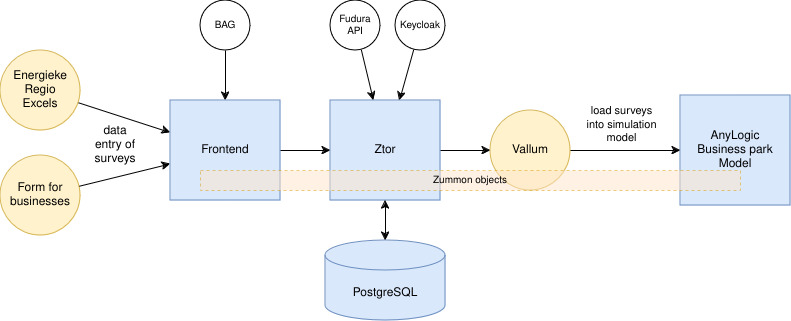
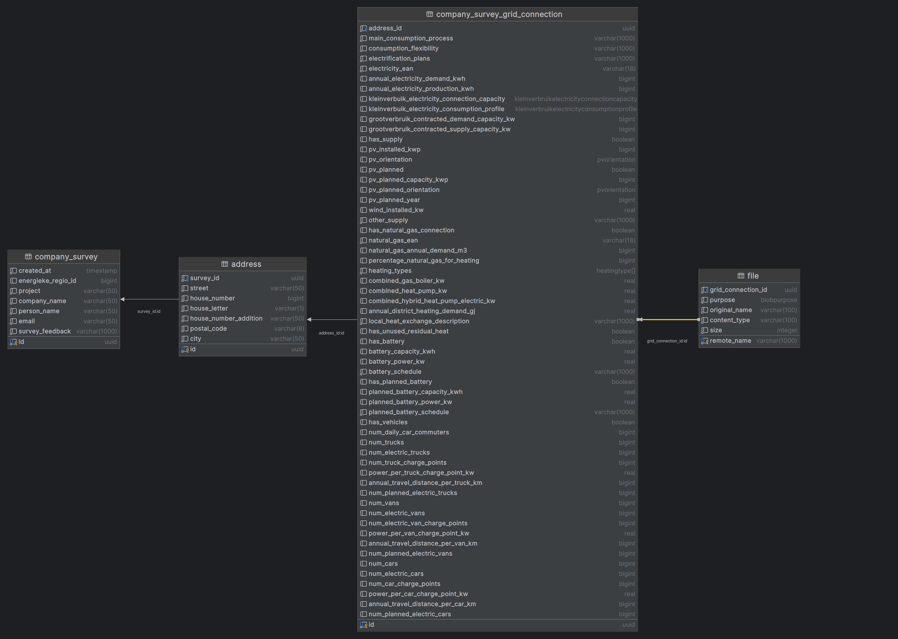
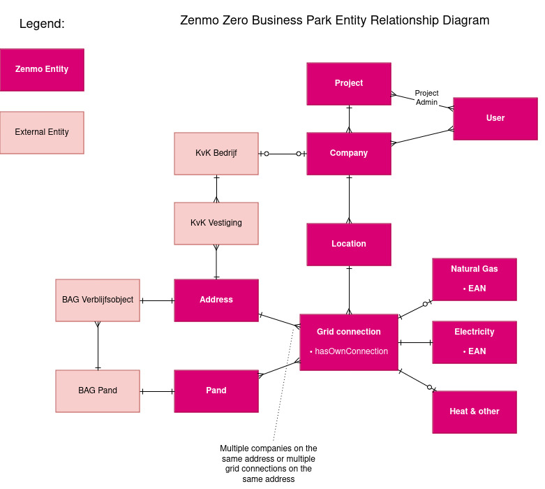

 Zenmo Zero
==========

Table of Contents
-----------------

- [About](#about)
- [Components](#Components)
- [Running locally](#running-locally)

About
-----

Zenmo Zero is a tool to simulate local energy systems.

This repository contains a web-based application to help bootstrap the Zenmo Zero simulation model with external data.

Works together with:

* [Zero Engine](https://github.com/Zenmo/zero_engine)
* [Zero Results UI](https://github.com/Zenmo/zero_results_UI)

Components
----------


(created using draw.io)

### [Frontend](frontend)

Graphical user interface. The company survey forms are here ([try one here!](https://zero-test.zenmo.com/bedrijven-hessenpoort)) and its web interface for administrators ([screenshot](docs/admin-screenshot.jpg)). 

It is hosted at [zero.zenmo.com](https://zero.zenmo.com).

This can also build a front-end library to include the survey in external websites.

### [Ztor](ztor)

This is the REST backend built on Ktor framework. 
Like AnyLogic it leans on the Java ecosystem.

### [Vallum](vallum)

Client for Ztor. This is a library to access the REST API from the 
AnyLogic business park model.
Artifacts are published to [GitHub packages](https://github.com/Zenmo/zero/packages/2239630)

### [Zummon](zummon)

Contains code to share between the front-end and other components. 
Builds to both an NPM package and JVM artifact. 

This is a class diagram of data transfer objects in Zummon which are 
relevant for Vallum (=AnyLogic):


(generated using Intellij)

### [Zorm](zorm)

Object-relational mapper for the core domain. This is to store surveys of companies in 
modelled business parks.

A library to access the domain entities from AnyLogic can be downloaded from [GitHub Packages](https://github.com/Zenmo/zero/packages/2104350)

This contains:

* database schema definition
* mapping to Java data transfer objects
* create, read, update and delete methods

Diagram of the relations: 


(generated using Intellij)

Planned database relations:

(created using draw.io)


### [Migrations](migrations)

This contains database migrations for PostgreSQL.
This intends to include ALL tables used by the web application and data import tools.

The SQL schema is generated by the Ktor application.
The migrations are created manually by diffing the generated schema with the previous version. Datagrip or pgAdmin can help create such a diff.
The migrations are applied by Flyway.

Steps to create 2 schema's:

```bash
git switch main
docker compose exec --user postgres postgres psql --command "CREATE DATABASE old"
DB_NAME=old docker compose run --rm ztor-gradle-with-db ztor:run --args=create-schema

git switch my-development-branch
docker compose exec --user postgres postgres psql --command "CREATE DATABASE new"
DB_NAME=new docker compose run --rm ztor-gradle-with-db ztor:run --args=create-schema
```

Now diff both schema's using a preferred tool and put the resulting SQL in a 
new file in [./migrations](./migrations)

Then run the migration on the active schema:

```
docker compose run --rm migrate
```

### [EP Online](ep-online)

This is a script to import the national dataset of energielabels to a PostgreSQL database.

### [Kleinverbruik](kleinverbruik)

Stedin, Liander and Enexis publish usage data of natural gas and electricity anually.
This is a small webservice which wraps this data so the frontend can request small parts of the data.

(this is partly defunct and this approach will be discontinued in favor of a database import).

### [Excel-read-named](excel-read-named-v5)

Library to read the Excel format filled out by [Energieke Regio]
(https://energiekeregio.nl) and Zenmo.

v5 uses the latest version of Apache POI, v3 uses an older version 
compatible with AnyLogic but it has issues with memory usage.

### [Fudura-client](fudura-client)

Gets metering data from Fudura.

Running locally
---

Local environment can be set up and run using Docker Compose

1\. Copy *.example.env files in [./docker/local](./docker/local) and fill in 
the variables.

2\. Install frontend dependencies

```bash
docker compose run --rm gradle-base zummon:jsBrowserProductionLibraryDistribution
docker compose run --rm npm install --include dev
```

3\. Start frontend

```bash
docker compose up -d frontend
```

The frontend should now be working. Validate this at 
[http://localhost:3000](http://localhost:3000).

4\. Start database

```bash
docker compose up -d postgres
```

5\. Initialize database schema

```bash
docker compose run --rm migrate
```

6\. Start backend

```bash
docker compose up -d ztor-run
```

It should be working. Validate this at 
[http://localhost:8082](http://localhost:8082). 
It should say "Ztor application".

6\. To fully use the application you need to add your Keycloak user to the 
table `user`, and add entries to the table `project` and`user_project`.
